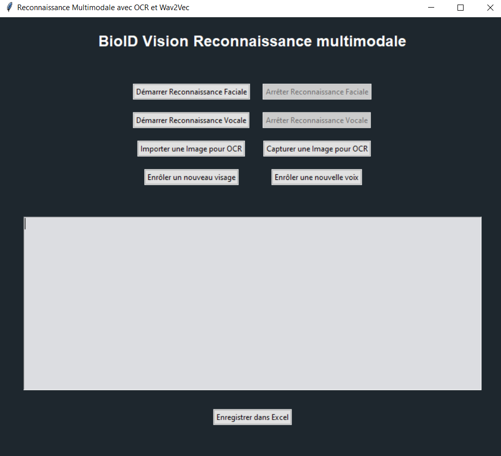

# BioID Vision — Identification biométrique multimodale

Application de bureau (Python / Tkinter) combinant **reconnaissance faciale**, **reconnaissance vocale** et **OCR** pour identifier un utilisateur à partir de plusieurs signaux biométriques complémentaires. Réalisée dans le cadre du mémoire de Master *Intelligence Artificielle & Big Data* (Université de Lomé / UTBM, soutenu le 9 août 2025).

> **English:** Desktop app combining facial recognition, voice recognition and OCR into one multimodal biometric identification system, built for a Master's thesis in AI & Big Data. See [Results](#résultats-mesurés-dans-le-mémoire) below for the measured accuracy figures, or the full thesis PDF linked at the bottom.



## Sommaire

- [Pourquoi ce projet](#pourquoi-ce-projet)
- [Modalités](#modalités)
- [Résultats mesurés dans le mémoire](#résultats-mesurés-dans-le-mémoire)
- [Installation](#installation)
- [Utilisation](#utilisation)
- [Structure du projet](#structure-du-projet)
- [Limites connues](#limites-connues)
- [Pistes d'amélioration](#pistes-damélioration)
- [Auteur & documentation complète](#auteur--documentation-complète)

## Pourquoi ce projet

Les systèmes d'authentification traditionnels (remplissage manuel de formulaires, reconnaissance unimodale) sont lents et vulnérables aux erreurs et à la fraude — un problème concret dans l'enregistrement d'abonnés en télécommunications. Ce projet explore une alternative : combiner trois traits biométriques indépendants (visage, voix, document d'identité) pour obtenir une identification plus rapide, plus précise et plus difficile à usurper qu'avec une seule modalité.

## Modalités

| Modalité | Technique | Rôle |
|---|---|---|
| Visage | Détection Haar Cascade (OpenCV) + classification KNN sur images 50×50 | Identification en temps réel via webcam |
| Voix | Embeddings Wav2Vec2.0 (`facebook/wav2vec2-base`) + classification KNN | Identification à partir d'un enregistrement audio de 5 s |
| Document | EasyOCR | Extraction de texte à partir d'une image ou d'une capture webcam |

L'interface Tkinter centralise l'enrôlement, le déclenchement de chaque reconnaissance et l'export des résultats vers Excel.

## Résultats mesurés dans le mémoire

Sur un échantillon de validation de 10 sujets (500 images par test facial, 30 échantillons vocaux, documents d'identité pour l'OCR) :

| Modalité | Condition | Précision |
|---|---|---|
| Visage | Conditions normales | **85 %** |
| Visage | Avec accessoires (lunettes, chapeau) | 70 % |
| Visage | Faible luminosité | 65 % |
| Visage | À plus de 2 m de la caméra | 60 % |
| Voix | Environnement silencieux | **93,3 %** |
| Voix | Environnement bruyant | 70 % |
| OCR | Documents d'identité | **88 %** |

Méthodologie complète, matrices de résultats et discussion : voir le mémoire (lien en bas de page).

## Installation

```bash
git clone https://github.com/honou-jean/Projet_de_soutenance.git
cd Projet_de_soutenance
python -m venv .venv
.venv\Scripts\activate     # Windows — sous macOS/Linux : source .venv/bin/activate
pip install -r requirements.txt
```

Le premier lancement télécharge automatiquement le modèle Wav2Vec2.0 (`facebook/wav2vec2-base`) depuis Hugging Face — une connexion internet est nécessaire à ce moment-là uniquement.

## Utilisation

```bash
python main.py
```

1. **Enrôler un nouveau visage / une nouvelle voix** — capture des données biométriques et met à jour le modèle correspondant.
2. **Démarrer/Arrêter Reconnaissance Faciale ou Vocale** — lance l'identification en direct via webcam ou micro.
3. **Importer/Capturer une image pour OCR** — extrait le texte d'un document.
4. **Enregistrer dans Excel** — exporte le journal de résultats affiché à l'écran.

## Structure du projet

```
main.py                          Point d'entrée
bioid_vision/
  config.py                      Chemins et constantes (aucun chemin codé en dur)
  face_recognition.py            Détection + classification faciale (Haar + KNN)
  voice_recognition.py           Embeddings vocaux + classification (Wav2Vec2.0 + KNN)
  ocr.py                         Extraction de texte (EasyOCR)
  export.py                      Export Excel
  gui.py                         Interface Tkinter, orchestre les trois modules ci-dessus
data/
  haarcascade_frontalface_default.xml
docs/
  screenshot.png
```

`face_data/` et `voice_data/` sont créés automatiquement au premier enrôlement et volontairement exclus du dépôt (`.gitignore`) puisqu'ils contiennent des données biométriques réelles.

## Limites connues

- Précision réduite en faible luminosité, avec des accessoires occultant le visage, ou à plus de 2 m de la caméra.
- La reconnaissance vocale se dégrade nettement en environnement bruyant.
- L'OCR interprète mal certains caractères spéciaux ou italiques.
- Chemins et paramètres pensés pour un usage local mono-poste, sans chiffrement des données biométriques stockées sur disque — à durcir avant tout usage en production.

## Pistes d'amélioration

Identifiées dans le mémoire : seuils adaptatifs et prétraitement d'image pour le visage, filtrage du bruit et microphones de meilleure qualité pour la voix, modèles OCR spécialisés pour les documents d'identité, post-traitement de correction orthographique.

## Auteur & documentation complète

**Koessivi Jean HONOU** — [portfolio](https://github.com/honou-jean) · Master Intelligence Artificielle & Big Data, Université de Lomé / UTBM (2025)

Méthodologie, revue de littérature et discussion complète des résultats : voir le mémoire de master associé à ce dépôt.
